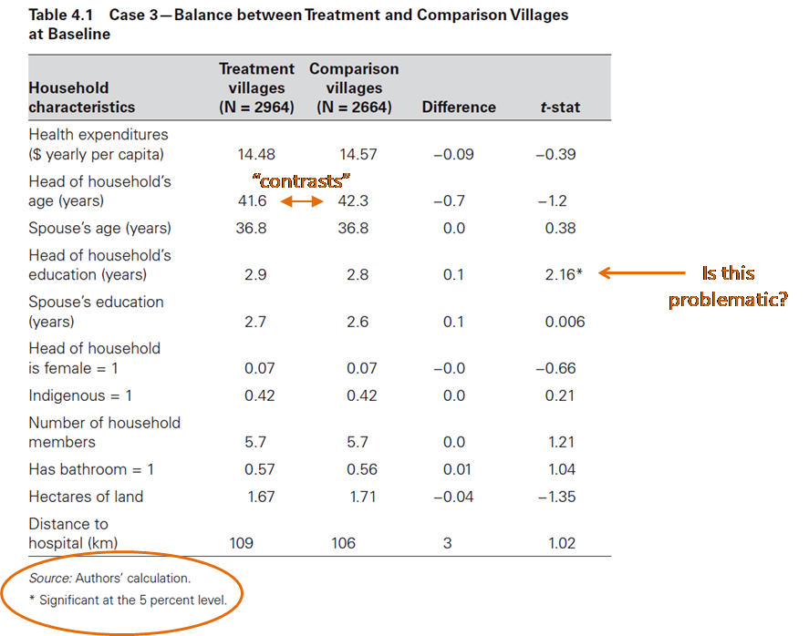
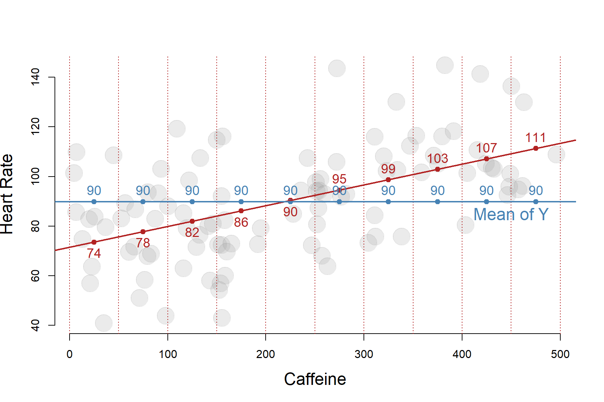
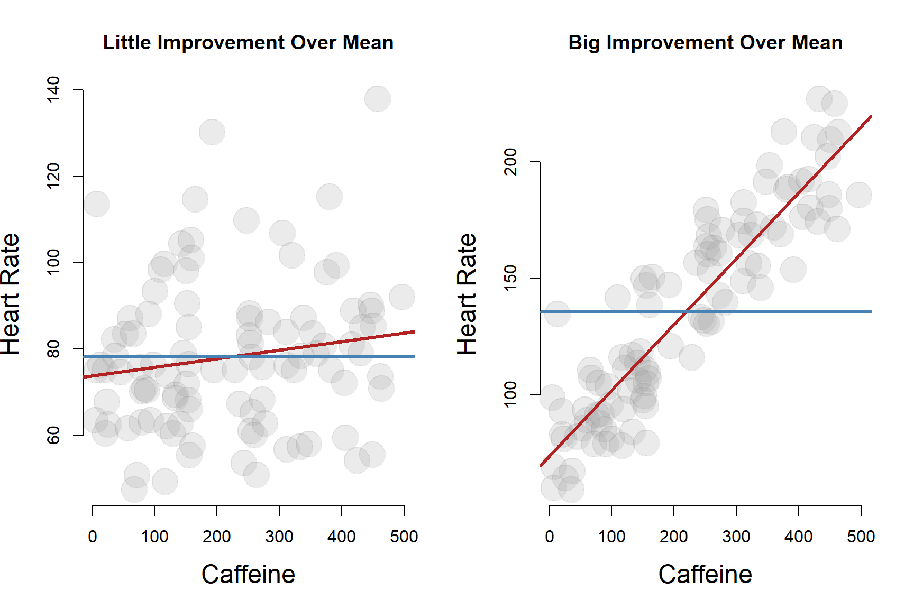
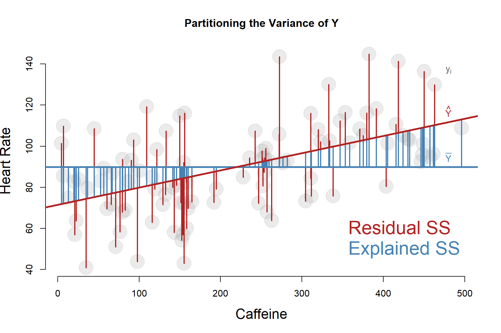

```{r setup, include=FALSE}
knitr::opts_chunk$set(echo = TRUE, message=F, warning=F, fig.width = 10, fig.pos = 'H')
```


```{r, echo=F, eval=F}

dat1 <- read.csv( "Full_Data_Updated.csv", stringsAsFactors=F )

# steps to create lab dataset from survey data:

dat <- select( dat1, Gender, Age, Income, DEGREE_LEVEL, YearProfExp, ExperienceCreateNP,  ExperienceFormNP,
               OtherNonprofit, TakenOnDebt, SeedFunding, Year1MostImportant )

names( dat ) <- c( "gender","age","income","edu.level","years.prof.exp",
                   "experience.np.create","experience.np.form","experience.np.other",
                   "take.on.debt","seed.funding","most.imp.fund.source" )


dat <- filter( dat, gender != "Other" )
dat <- filter( dat, ! is.na( gender ) )
table( dat$gender, useNA="ifany" )

dat$edu.level <- factor( dat$edu.level,
                             levels=c(NA,"None","High School","Some College",
                                      "Bachelor","Graduate") )
table( dat$edu.level )


# 

table( dat$years.prof.exp, useNA="ifany" )

dat$years.prof.exp[ dat$years.prof.exp  == "Don't know" ] <- NA
dat$years.prof.exp[ is.na(dat$years.prof.exp) ] <-"15+"

dat$years.prof.exp <- factor( dat$years.prof.exp,
                            levels=c(NA, "0", "1-2", "3-5",
                                     "6-10", "11-15", "15+"))


### Did the founding team include someone who has:

# Help create a new nonprofit? 

table( dat$experience.np.create, useNA="ifany" )
dat$experience.np.create[ is.na(dat$experience.np.create) ] <- "No"
dat$experience.np.create[ dat$experience.np.create == "I don't know." ] <- "No"
dat$experience.np.create <- factor( dat$experience.np.create )
table( dat$experience.np.create )


# Helped found another nonprofit?


table( dat$experience.np.form, useNA="ifany" )
dat$experience.np.form[ is.na(dat$experience.np.form) ] <- "No"
dat$experience.np.form[ dat$experience.np.form == "I don't know." ] <- "No"
dat$experience.np.form <- factor( dat$experience.np.form )


# Have you worked as a director or board member of another nonprofit?


table( dat$experience.np.other, useNA="ifany" )
dat$experience.np.other[ is.na(dat$experience.np.other) ] <- "No"
dat$experience.np.other <- factor( dat$experience.np.other )


# Have any members of the organization taken on debt to finance the organization? Collectively:

table( dat$take.on.debt, useNA="ifany" )
dat$take.on.debt[ is.na(dat$take.on.debt) ] <- "$0"
dat$take.on.debt <- factor( dat$take.on.debt )

# Did you receive any SEED FUNDING to start the organization? Seed funding supports development of the organization without requiring deliverables or program activities. Seed funding could also include funding for pilot programs.


table( dat$seed.funding, useNA="ifany" )
dat$seed.funding[ is.na(dat$seed.funding) ] <- "No"
dat$seed.funding[ dat$seed.funding == "I don't know." ] <- "No"
dat$seed.funding <- factor( dat$seed.funding )


# Of this same list of funding sources, which has been the MOST important in your first year of operations? Choose one.


table( dat$most.imp.fund.source, useNA="ifany" )

dat$most.imp.fund.source[ is.na(dat$most.imp.fund.source) ] <- "Donations"
dat$most.imp.fund.source[ dat$most.imp.fund.source == "Don't know" ] <- "Donations"

levs <- c("Donations", "Founder", "Earned Revenues", "Foundation Grant", 
"Gov Grant", "Member Fees", "Parent Org", "Angel", "Corp Grant")

dat$most.imp.fund.source <- factor( dat$most.imp.fund.source, levels=levs )


# > levels(dat1$Income) %>% dput()
# c("0-20k", "20k-40k", "40k-60k", "60k-80k", "80k-100k", "100k")
income.level <- as.character(dat$income)
income.level[ is.na(income.level) ] <- "NA"
gender <- dat$gender

tail <- c( 100000:150000, 100000:150000, 150000:200000 )

income <- rep( NA, length(income.level) )
income[ income.level == "0-20k" ]    <- sample(      1:20000, length(income.level) )
income[ income.level == "20k-40k" ]  <- sample(  20000:40000, length(income.level) )
income[ income.level == "40k-60k" ]  <- sample(  40000:60000, length(income.level) )
income[ income.level == "60k-80k" ]  <- sample(  60000:80000, length(income.level) )
income[ income.level == "80k-100k" ] <- sample(  80000:100000, length(income.level) )
income[ income.level == "100k" ]     <- sample(  tail, length(income.level) )

summary( income )

tapply( income, gender, summary )

d2 <- data.frame( income, gender )


ggplot( d2, aes( x=income, fill=gender )) + 
        geom_density( alpha=0.5) +
        xlab( "Income" )


# Please specify your income range prior to working to create this nonprofit (or currently if it has not changed):

dat$income <- income
dat$income[ is.na(dat$income) ] <- median( dat$income, na.rm=T )

dat$gender <- factor( dat$gender )

saveRDS( dat, "female-np-entrepreneurs.rds" )
write.csv( dat, "female-np-entrepreneurs.csv", row.names=F )

```


```{r, echo=FALSE, results="hide"}
library( stargazer )
library( dplyr )
library( pander )
library( ggplot2 )
```


# Overview 


## The policy problem

Women have historically been under-represented in entrepreneurship in the US. 

According to the Kauffman Index of Startup Activity National Report (2017), the rate of new male entrepreneurs is almost double the rate of female entrepreneurs and over the past two decades men have owned two-thirds of all businesses. As a result, there is a growing interest in understanding what motivates women to participate in entrepreneurial processes. 

This study draws upon survey data of nonprofit entrepreneurs – individuals that have recently created new nonprofits. This week's lab data consists of 657 founders that have responded to a series of survey questions describing their backgrounds and their organizations. Unlike other industries, over 50 percent of nonprofit entrepreneurs are women: 55 percent of respondents are female in this sample. 

We would like to design a study where we follow a new nonprofit for five years and assess success of the launch measured by (1) survival of the first five years of operation, (2) growth of organizational programs measured by annual program expenses, and (3) a survey of peer organizations to assess their reputations with regards to quality of programs and community impact. The study aims to establish whether female entrepreneurs are more or less successful than their male counterparts. 

Observed differences in performance could be explained by one of two distinct theories (or both together).  

The first explanation for performance differences is a **behavioral theory – women innately approach the entrepreneurial task differently than men**. This would include things like attitudes toward risk, decision-making processes, leadership styles, etc. To make it concrete, behavioral economics provides us with a recent example from the investment world:

*Terry Odean, a University of California professor, has studied stock picking by gender for more than two decades. A seven-year study found single female investors outperformed single men by 2.3 percent, female investment groups outperformed male counterparts by 4.6 percent and women overall outperformed by 1.4 percent. Why? The short answer is overconfidence. Men trade more, and the more you trade, typically the more you lose — not to mention running up transaction costs. [Washington Post 2013]*

The overconfidence is partly tied to higher levels of testosterone in men, a hormone that leads to more decisive or compulsive decision-making. Thus, the male investors exhibit a tendency to make trades at a higher frequency when they have access to the same information as female investors. 

One could brainstorm other potential behavior differences in how men and women approach entrepreneurial tasks – how they communicate with team members, how they yield power over subordinates, how they build trust with stakeholders, and how they communicate the vision for the organization to funders, to name a few. Collectively, these subtle behavioral differences could lead to better or worse performance for organizations that are created and run by women. 

Alternatively, the second theory is a resources theory. Entrepreneurial success is largely predicted by resources at the time of start-up: access to financial capital, the amount of knowledge about the specific product or program domain, and past start-up experience. Consequently, the resources that an entrepreneur has at the time the new business is created will largely predict success.

If **male and female entrepreneurs have different initial levels of resources** when the organizations are started then performance might appear to be driven by male and female behavioral differences, but in fact gender could simply be a proxy for resources. Or stated differently, gender predicts the level of resources founders have at the point of business creation, and resources predict success. 

Or stated differently, men and women with similar levels of resources produce start-ups that are equally successful. 

As an example of this phenomenon, a 2003 study examined the financial performance of large companies run by women and concluded that women make worse CEOs than men. After reading the new story, University of Exeter researchers Michelle Ryan and Alexander Haslam re-examined the data and identified the Glass Cliff phenomenon. It turns out it was NOT the case that women make worse CEOs than men - they actually found that female CEOs had more positive impact than similar male CEOs in many instances. The problem was women were only promoted to leadership opportunities in failing companies. 

*“The glass cliff is a phenomenon whereby women (and other minority groups) are more likely to occupy positions of leadership that are risky and precarious. This can happen when share price performance is poor, when facing a scandal, or when the role involves reputational risk.”*

*“When firms are doing poorly, the really qualified white male candidates say, ‘I don’t want to step into this,’ Women and minorities might feel like this might be their only shot, so they need to go ahead and take it.”[Vox 2018]*

In other words, all else equal female CEOs took over companies with fewer resources and worse initial performance than the companies that hired male CEOs. 

In the nonprofit context things like a scarcity of mentoring or leadership opportunities for women at early stages of their career, lower wages, and career gaps associated with care-taking responsibilities of kids or aging parents could lead to lower levels of financial and professional capital at the time of organizational creation. 

So there is a bit of a nature and nuture component to the research. There are innate (or perhaps socially programmed) differences in how men and women make decisions, evaluate risk, build teams, model leadership, and manage conflict. And there are other aspects of gender that are accidental like savings at the time of start-up. Programs like mentoring or seed grants for female entrepreneurs can erase the resource differences, but they cannot erase the innate differences or cumulative effects of past discrimination. 

The departure point of the research is thus descriptive - a basic understanding of resource differences and behavioral differences observed during the start-up process is necessary to start building a research agenda for the field. 

https://www.washingtonpost.com/business/behavioral-economics-show-that-women-tend-to-make-better-investments-than-men/2013/10/10/5347f40e-2d50-11e3-97a3-ff2758228523_story.html

https://www.vox.com/2018/10/31/17960156/what-is-the-glass-cliff-women-ceos

*L. Camarena, M. Feeney, & J. Lecy: "Nonprofit Entrepreneurship: The Landscape of Gendered Leadership." Working paper.*

<br>


## Learning Objectives

This lab focuses on the resources question - are there differences in the financial and professional capital men and women have when they start nonprofits? 

This is an example of **establishing study group equivalence**, which is a prerequisite for valid inferences for some (but not all) of the estimators you will learn in this class. 

The reason randomization is powerful is because it generates equivalent treatment and control groups since randomization ensures that proportions of observed and unobserved traits (gender, age, etc.) are the same in each group. This ensures that the only difference between the groups is the treatment, which is what allows us to interpret performance differences in the post-treatment period as treatment or program effects. Since all other group characteristics are identical, none of them should explain the outcome. The test for “happy randomization” in RCTs is a test of group equivalence. 

As such, this example will focus on the second theory of performance differences – the resources that the entrepreneurs bring to the table. 

The test for group equivalence prior to the nonprofit launch will show us whether male and female entrepreneurs in the nonprofit sector have similar experience, financing and support to carry them through the process. 

If they are equivalent then any performance differences between organizations started by men and organizations started by women are more likely to be driven more by behavioral considerations than structural ones. We can eliminate resources as an explanation and focus on ways in which women approach or experience the start-up process that is different from men. 

The lab will show you how to compare characteristics of two groups in a study to establish equivalence. 


<br>


# Establishing Group Equivalence 


## Contrasts 

A **contrast** is a **statistical comparison** of means of two groups. 

In regular mathematics, if we say a cup of flour weighs the same as 0.79 cups of sugar, then we are claiming the weight is the same for the measured amounts of both ingredients (in chemistry these measures have to be extremely precise). 

In physics, we can establish that all objects travel the same speed when falling through a vacuum using mathematical proofs. Theoretically the velocity the same number. 

In statistics the statement that two groups are the same implies that there are mathematical differences in group means (it is rare to get precisely the same group means in samples), but **there are NO statistically significant differences** of the group means. 


For example, in this instance the average age of male and female founders differs by a year or two:

```{r, echo=F}
d <-
structure(list(Age = c(54L, 62L, 70L, 63L, 60L, 41L, 45L, 42L, 
63L, 73L, 63L, 60L, 50L, 80L, 50L, 31L, 64L, 30L, 62L, 64L, 65L, 
29L, 55L, 26L, 55L, 53L, 66L, 33L, 61L, 35L, 53L, 59L, 65L, 68L, 
80L, 62L, 49L, 51L, 41L, 66L, 37L, 29L, 66L, 37L, 58L, 62L, 38L, 
65L, 70L, 37L, 52L, 55L, 71L, 37L, 54L, 67L, 57L, 30L, 56L, 59L, 
50L, 48L, 52L, 53L, 35L, 56L, 59L, 43L, 52L, 66L, 55L, 57L, 70L, 
58L, 42L, 72L, 55L, 66L, 46L, 48L, 68L, 71L, 54L, 29L, 68L, 53L, 
NA, 51L, 55L, 50L, 45L, 60L, 68L, 61L, 56L, 41L, 55L, 39L, 53L, 
37L, 46L, 54L, 52L, 37L, 50L, 57L, 45L, 40L, 64L, 45L, 54L, 60L, 
53L, 60L, 60L, 70L, 51L, 34L, 56L, 47L, 41L, 68L, 63L, 61L, 55L, 
44L, 62L, 64L, 61L, 34L, 46L, 52L, 38L, 57L, 56L, 41L, 54L, 59L, 
59L, 38L, 54L, 55L, 60L, 56L, 27L, 71L, 40L, 55L, 62L, 46L, 57L, 
60L, 39L, 40L, 57L, 73L, 67L, 47L, 77L, 72L, 42L, 42L, 39L, 40L, 
74L, 51L, 49L, 68L, 59L, NA, 50L, 76L, 75L, 70L, 55L, 39L, 53L, 
60L, 59L, 59L, 63L, 46L, 52L, 39L, 56L, 49L, 50L, 55L, 35L, 56L, 
70L, 44L, 44L, 56L, 74L, 47L, 62L, 43L, 56L, 75L, 72L, 46L, 35L, 
36L, 30L, 46L, 71L, 57L, 64L, 44L, 67L, 48L, 36L, 71L, 38L, 47L, 
36L, 29L, 55L, 29L, 36L, 65L, 38L, 51L, 55L, 44L, 33L, 71L, 56L, 
29L, 60L, 75L, 41L, 72L, 34L, 37L, 63L, NA, 59L, 47L, 51L, 45L, 
78L, 41L, 65L, 46L, 35L, 50L, 54L, 69L, 64L, 48L, 61L, NA, 64L, 
30L, 64L, 62L, 50L, 26L, 46L, 52L, 50L, 73L, 70L, 33L, 63L, 57L, 
45L, 47L, 48L, 38L, 45L, 41L, 36L, 55L, 55L, 81L, 55L, 65L, 52L, 
52L, 42L, 29L, 64L, 79L, 40L, 75L, 60L, 53L, 46L, 52L, NA, 53L, 
66L, 51L, 57L, 53L, 74L, 45L, 55L, 41L, 51L, 71L, 58L, NA, 64L, 
52L, 65L, NA, 64L, 72L, 51L, 47L, 55L, 46L, 63L, 71L, 48L, NA, 
49L, 65L, 59L, 36L, 54L, 44L, 65L, 46L, 65L, 34L, 57L, 49L, 65L, 
42L, 51L, 63L, 41L, 64L, 47L, 50L, 35L, 42L, 57L, 55L, 35L, 46L, 
35L, 45L, 60L, 57L, 53L, 52L, 53L, 66L, 74L, 38L, 78L, 63L, 43L, 
57L, 55L, 73L, NA, 62L, 38L, 79L, 42L, 37L, 67L, 58L, 57L, 58L, 
44L, 27L, 43L, 49L, 62L, 29L, 75L, 59L, 39L, 57L, 48L, 49L, 57L, 
41L, 59L, 65L, 72L, 58L, 59L, 65L, 62L, 65L, 48L, 63L, 41L, NA, 
38L, 51L, 44L, 37L, 74L, 30L, 57L, 54L, 58L, 44L, 61L, 49L, 85L, 
53L, 36L, 81L, 60L, 36L, 58L, 36L, 74L, 80L, 34L, 40L, 41L, 51L, 
54L, 64L, 63L, NA, 41L, 48L, 65L, 72L, 22L, 55L, 47L, 53L, 65L, 
70L, 51L, 64L, 56L, 49L, 47L, 50L, 43L, 69L, 35L, 56L, 69L, 58L, 
55L, 41L, 56L, 54L, 63L, 53L, 60L, 47L, 51L, 61L, 78L, 50L, 26L, 
72L, 72L, 64L, 44L, 50L, 68L, 50L, 59L, 51L, 66L, 57L, 54L, 43L, 
38L, 58L, 65L, 71L, 43L, 33L, 42L, 52L, 48L, 34L, NA, 66L, 32L, 
67L, 42L, 62L, 70L, 62L, 64L, 48L, 37L, 58L, 54L, NA, 52L, 40L, 
55L, 49L, 59L, NA, 62L, 51L, 59L, 51L, 60L, 48L, 51L, 63L, NA, 
64L, 57L, 70L, 60L, 52L, 70L, 59L, 42L, 60L, 55L, 53L, 72L, 41L, 
62L, 78L, 65L, 52L, 62L, 62L, 50L, 57L, 54L, 71L, 46L, 64L, 62L, 
42L, 36L, 60L, 64L, 44L, 63L, 52L, 64L, 53L, 60L, 60L, 66L, 42L, 
62L, 52L, 82L, 40L, 36L, 38L, 61L, 65L, 49L, 38L, 69L, 42L, 50L, 
60L, 32L, 56L, 62L, 69L, 54L, 42L, 37L, 53L, 33L, 54L, NA, NA, 
NA, 40L, 29L, 33L, 58L, 51L, 63L, NA, 41L, 43L, 64L, 62L, 51L, 
56L, NA, 50L, 24L, 50L, 33L, 44L, 31L, 55L, 56L, 57L, 48L, 30L, 
40L, 55L, 50L, 26L, 52L, 70L, 41L, 33L, 31L, 44L, 46L, 70L, 55L, 
52L, 64L, 50L, 79L, 57L, 65L, 48L, 67L, 32L, 67L, 59L, 57L, 71L, 
64L, 30L, 62L, 65L, 51L, 43L, 71L, 69L, 58L, 40L, 37L, 33L, 60L, 
59L, 51L, 38L, 58L, 66L, 55L, 60L, 65L, 51L, 50L, 35L, 47L), 
    Gender = c("Female", "Female", "Female", "Male", "Female", 
    "Female", "Male", "Male", "Male", "Male", "Male", "Male", 
    "Female", "Male", "Female", "Female", "Male", "Female", "Female", 
    "Female", "Female", "Male", "Female", "Female", "Female", 
    "Male", "Male", "Male", "Male", "Male", "Female", "Female", 
    "Male", "Female", "Female", "Male", "Female", "Male", "Male", 
    "Male", "Female", "Male", "Male", "Female", "Female", "Male", 
    "Male", "Male", "Male", "Female", "Female", "Female", "Male", 
    "Male", "Male", "Male", "Female", "Female", "Female", "Female", 
    "Female", "Male", "Female", "Male", "Female", "Male", "Male", 
    "Female", "Male", "Female", "Female", "Male", "Male", "Male", 
    "Female", "Female", "Female", "Male", "Female", "Female", 
    "Male", "Female", "Female", "Female", "Male", "Male", "Female", 
    "Female", "Female", "Male", "Male", "Female", "Female", "Male", 
    "Female", "Female", "Female", "Female", "Male", "Female", 
    "Female", "Female", "Female", "Male", "Male", "Female", "Male", 
    "Male", "Male", "Female", "Female", "Female", "Female", "Female", 
    "Male", "Male", "Female", "Male", "Female", "Male", "Female", 
    "Male", "Male", "Female", "Female", "Female", "Male", "Female", 
    "Male", "Female", "Female", "Male", "Male", "Male", "Female", 
    "Female", "Male", "Male", "Female", "Male", "Female", "Male", 
    "Female", "Female", "Female", "Male", "Female", "Female", 
    "Male", "Female", "Male", "Male", "Male", "Female", "Female", 
    "Female", "Male", "Female", "Male", "Male", "Male", "Male", 
    "Male", "Female", "Female", "Female", "Male", "Female", "Female", 
    "Female", "Male", "Male", "Female", "Male", "Female", "Female", 
    "Male", "Male", "Female", "Male", "Female", "Female", "Female", 
    "Female", "Male", "Male", "Male", "Female", "Female", "Female", 
    "Female", "Female", "Female", "Male", "Female", "Male", "Male", 
    "Female", "Female", "Male", "Male", "Female", "Male", "Female", 
    "Female", "Female", "Male", "Female", "Male", "Female", "Female", 
    "Female", "Female", "Female", "Male", "Female", "Female", 
    "Female", "Female", "Male", "Male", "Male", "Female", "Male", 
    "Male", "Female", "Male", "Male", "Female", "Male", "Male", 
    "Female", "Female", "Female", "Male", "Male", "Male", "Female", 
    "Female", "Female", "Female", "Female", "Male", "Male", "Female", 
    "Female", "Male", "Male", "Female", "Male", "Female", "Female", 
    "Female", "Female", "Male", "Female", "Female", "Male", "Male", 
    "Female", "Female", "Female", "Female", "Female", "Female", 
    "Male", "Female", "Female", "Male", "Female", "Female", "Female", 
    "Male", "Female", "Female", "Male", "Female", "Male", "Female", 
    "Male", "Female", "Female", "Female", "Male", "Female", "Male", 
    "Male", "Female", "Female", "Female", "Male", "Female", "Male", 
    "Male", "Male", "Female", "Male", "Female", "Male", "Male", 
    "Male", "Female", "Male", "Female", "Female", "Female", "Male", 
    "Male", "Male", "Female", "Female", "Male", "Male", "Male", 
    "Female", "Female", "Female", "Female", "Female", "Female", 
    "Female", "Male", "Male", "Female", "Female", "Female", "Female", 
    "Male", "Female", "Male", "Male", "Female", "Male", "Female", 
    "Female", "Male", "Female", "Male", "Female", "Male", "Male", 
    "Male", "Female", "Female", "Female", "Female", "Female", 
    "Female", "Female", "Male", "Male", "Female", "Female", "Male", 
    "Male", "Female", "Male", "Male", "Female", "Male", "Female", 
    "Male", "Male", "Female", "Male", "Male", "Female", "Female", 
    "Female", "Female", "Female", "Female", "Female", "Female", 
    "Female", "Male", "Male", "Male", "Female", "Male", "Female", 
    "Male", "Female", "Female", "Male", "Male", "Male", "Female", 
    "Female", "Male", "Male", "Male", "Male", "Male", "Female", 
    "Male", "Female", "Female", "Male", "Male", "Female", "Male", 
    "Male", "Male", "Female", "Male", "Female", "Female", "Female", 
    "Female", "Female", "Male", "Female", "Male", "Male", "Female", 
    "Female", "Male", "Male", "Male", "Male", "Female", "Female", 
    "Female", "Female", "Male", "Female", "Female", "Female", 
    "Male", "Male", "Female", "Female", "Female", "Female", "Female", 
    "Male", "Male", "Male", "Male", "Female", "Female", "Female", 
    "Female", "Female", "Male", "Female", "Male", "Male", "Female", 
    "Female", "Female", "Female", "Female", "Female", "Female", 
    "Female", "Female", "Female", "Male", "Female", "Male", "Female", 
    "Female", "Female", "Male", "Male", "Male", "Female", "Male", 
    "Male", "Female", "Male", "Female", "Female", "Female", "Male", 
    "Male", "Male", "Male", "Female", "Female", "Female", "Male", 
    "Female", "Male", "Male", "Male", "Female", "Female", "Female", 
    "Male", "Male", "Female", "Male", "Male", "Female", "Female", 
    "Female", "Female", "Male", "Male", "Female", "Male", "Female", 
    "Female", "Female", "Male", "Female", "Female", "Male", "Female", 
    "Female", "Male", "Female", "Female", "Female", "Male", "Male", 
    "Female", "Female", "Male", "Male", "Male", "Female", "Female", 
    "Female", "Male", "Female", "Female", "Female", "Male", "Male", 
    "Female", "Male", "Male", "Male", "Male", "Female", "Male", 
    "Female", "Male", "Female", "Female", "Female", "Male", "Male", 
    "Female", "Male", "Female", "Female", "Female", "Male", "Male", 
    "Female", "Female", "Male", "Female", "Male", "Female", "Female", 
    "Male", "Female", "Female", "Male", "Male", "Female", "Female", 
    "Female", "Female", "Male", "Male", "Female", "Female", "Female", 
    "Male", "Male", "Male", "Female", "Male", "Male", "Female", 
    "Male", "Male", "Male", "Female", "Female", "Female", "Female", 
    "Female", "Male", "Male", "Male", "Female", "Female", "Female", 
    "Female", "Female", "Female", "Male", "Male", "Female", "Female", 
    "Male", "Male", "Female", "Female", "Female", "Female", "Female", 
    "Male", "Male", "Female", "Male", "Male", "Female", "Male", 
    "Female", "Male", "Female", "Female", "Female", "Female", 
    "Male", "Female", "Female", "Male", "Male", "Male", "Male", 
    "Female", "Male", "Female", "Male", "Male", "Female", "Female", 
    "Male", "Male", "Male", "Male", "Male", "Male", "Male", "Male", 
    "Male", "Male", "Male", "Female", "Male", "Female", "Male", 
    "Female", "Female", "Female", "Male", "Male")), row.names = c(NA, 
-657L), class = "data.frame")

d <- na.omit( d )

set.seed( 1234) 
d <- sample_n( d, 100 )

d %>% 
  group_by( Gender ) %>% 
  summarize( min.age=min(Age), median.age=median(Age), mean.age=mean(Age), max.age=max(Age) ) %>% 
  pander()

ggplot( d, aes( x=Age, fill=Gender )) + 
        geom_density( alpha=0.5) +
        xlab( "Age" )
```


But when we test for significance we find that the contrast is not statistically significant:


```{r}
t.test( Age ~ Gender, data=d )
```

Specifically, the p-value of the t-test is greater that 0.05. 

----  

Make a mental note that **statistically identical** is different than **mathematically identical**.

Randomization produces statistically identical treatment and control groups, not mathematically identical groups (the observed means of the two groups will still differ by small amounts). 

The contrast, then, is a **comparison of group means with a test for significance**. 

Contrasts are typically reported in a table by listing the two means, reporting their differences, and either reporting p-values associated with the differences or including starts that signal significant differences. In some cases the t-statistic is reported instead of the p-value, but the rule of thumb is that a t-stat over 2 implies statistical significance at the alpha=0.05 level (a 95% confidence interval). 



If groups are equivalent we should expect that tests show no meaningful differences across a set of measures that describe the study population. They are typically presented in tabular form like this table below describing villages that participated in an economic development program and the villages they have been matched to for comparison. If the matching worked then we should have a group that is identical to the treatment group – no significant differences exist. 

Randomization *almost always* produces statistically identical treatment and control groups, but there are other quasi-experimental techniques that are used to generate **balanced groups**, meaning groups that have no observed differences in the traits that are measured and reported in the data.

It is important to note that these approaches can generate subsamples that are balanced on observed characteristics, but randomization ensures that groups are balanced on both observed and unobserved characteristics. 

The problem with omitted variables is we don't always know what they even are, so it's hard to ensure you have included ALL variables that might matter in a regression. Since randomization produces balance in unobserved traits it fixes omitted variable bias problems that you were not even aware you had! Which is why RCTs are "the gold standard" in causal inference and astute policy-makers will look for convergence in results across several quasi-experimental studies before trusting the inferences. 

<br>


## Contrasts with Categorical Variables 


When examining group composition it is common to include traits like race and gender that are categorical and not continuous. 

T-tests are used to conduct a contrasts when measures are continuous, but they do not work when the variable is categorical (how would you calculate the average of four categories of race?).

When variables are categorical we will instead use a chi-square test. It is a common **test for independence of factor levels** in statistics. 

What do we mean by a test for independence? 

Recall the meaning of statistical significance in the regression context. If the slope coefficient is significant then knowing information about the treatment (milligrams of caffeine consumed) should give you information about the outcome (heart rate). 




If we know nothing about caffeine intake then our best guess for a person's heart rate is the average heart rate of all people in the sample. 

If our model is meaningful (the slope is significant) then our best guess for a person's heart rate is the average of all individuals that consumed the same amount of caffeine, or the predicted value of Y for a level of X (the point on the regression line). 



For any given individual this distance from their actual heart rate to the regression line (red line) should be shorter than the distance from their actual heart rate to the mean (blue line). The improvement of the best guess using the regression line over simply using the sample mean for all individuals is the variance that is "explained" by the model.  



So let's apply this same predictive reasoning to understand the meaning of a test for independence. 

This example uses data about hair color and eye color from 592 individuals to test the independence of these two traits. We would create a cross-tab of the two traits using `table( hair, eyes )` in order to produce a table like the one stored in the vcd package:


```{r}
# library(vcd)
# data( HairEyeColor )
# 
# combine genders for example:
# m1 <- HairEyeColor[ , , 1 ]
# m2 <- HairEyeColor[ , , 2 ]
# m3 <- m1 + m2
# dput( m3 )

m <-
structure(c(68, 119, 26, 7, 20, 84, 17, 94, 15, 54, 14, 10, 5, 
29, 14, 16), class = "table", .Dim = c(4L, 4L), .Dimnames = list(
    Hair = c("Black", "Brown", "Red", "Blond"), Eye = c("Brown", 
    "Blue", "Hazel", "Green")))

m %>% pander()

```

What does it mean for the categorical variables to be **independent**? 

Similar to the regression model above, if the slope coefficient for caffeine is not statistically significant than the y-hat values from the regression model will do no better than simply using y-bar from the population.

In this example we are trying to predict eye color. If we have no information other than sample characteristics then we should guess the modal value, which is brown in this case: 

```{r}
apply( m, MARGIN=2, FUN=sum )
```


If hair color and eye color are correlated, then knowing something about hair color would give us additional information about eye color. If so, then these variables are NOT independent.

If so, then the groups with different hair colors should all have proportionally similar numbers of brown-eyed indivdiduals, blue-eyed individuals, hazel and green. But we see that is not in fact the case - there should be approximately 37% of each group with brown eyes but we see that people with black hair have brown eyes at higher rates than the population average, and people with blonde hair have brown eyes at lower rates than the population average. 

```{r}
# margin=1 calculates proportions by row; each row sums to 1
# margin=2 calculates proportions by column: each column sums to 1
# margin=NULL returns cells as a proportion of the whole table

( apply( m, MARGIN=2, FUN=sum ) / sum(m) ) %>% round(2)

m %>% prop.table( margin=1 ) %>% round(2)

```

In other words, hair color and eye color are NOT independent. They are, in fact, correlated. 

The mosaic plot in the **vcd** package provides a nice visualization of these cross-tabs:

```{r}
vcd::mosaic( m, shade=TRUE, legend=TRUE )
```
Cells are sized to represent total proportion. Blue signifies cells where we observe more cases then expected **when the factors are independent**, and red signifies there are less cases observed than expected. 

Note that the "brown hair" row is all gray, meaning that people with brown hair have eye colors that approximately match the population. Glancing back at the table we see this is true.

```{r, echo=T}
population <- ( apply( m, MARGIN=2, FUN=sum ) / sum(m) ) %>% round(2)
m2 <- m %>% prop.table( margin=1 ) %>% round(2)
brown.hair <- m2[ 2, ]
m3 <- rbind( population, brown.hair )
m3 %>% pander()
```

And then, of course, the groups will never be mathematically identical (the row proportions all the same as the population proportions) so we need a test for significance, which is what the chi-square test provides: 

```{r}
chisq.test( m )
```

The p-value is less than 0.05, so the factor levels are **dependent**, i.e. they are correlated. Thus, if we know something about hair color then we can make a better prediction of eye color. 

If we know the person's hair color is blonde, we should guess their eyes are blue, not brown. 

------

In the program evaluation context the column factor would describe the sample, e.g. race or gender, and the row factor would be the treatment and control categories. 

The test for independence would tell us whether proportions of levels of the factor are more-or-less equal in the treatment and control groups. 

If we use gender as the example, then the chi-square test would tell us whether we have equal proportions of men and women in the treatment and control groups:

```{r}
set.seed( 1234 )
gender <- sample( c("male","female","male"), 100, replace=T )
study.group <- sample( c("treatment","control"), 100, replace=T )

t <- table( study.group, gender )
t %>% prop.table( margin=1 ) %>% round(2) %>% pander()
```

We see that we have approximately one-third female in each study group. The chi-square test shows us that the groups are equivalent on this measure (the test is NOT statistically significant): 

```{r}
chisq.test( t )
```


<br>


## P-Value Corrections for Omnibus Tests 


In the examples above each **contrast** is a test for **group differences for individual variables**. 

But how do we know if collectively the groups are equivalent across a bunch of variables? 


The is no specific test that compares a bunch of variables at once. Instead the criteria is that if none of the variables are statistically different then the groups are considered equivalent. 

There is a problem here, though!

Our decision criteria allows for Type I errors (incorrectly identifying difference that don't actually exist) five percent of the time. So let's assume that we are comparing 20 group attributes in our table. Assuming group equivalence, if the probability of a Type I error is five percent **for a single variable** what happens if we **test 20 variables at the same time**? What is the likelihood that we observe **at least one contrast with a p-value below 0.05** when the groups are statistically identical, leading us to incorrectly conclude that the groups are not equivalent? 

It's a lot more than 0.05 if we perform 20 independent contrasts and use the same decision criteria for rejecting the null that we use for a single test. 

We can demonstrate the issue with a coin-flip example. Assume a set of casinos has started offering a coin flip game (heads the casino wins, tail favors the gamblers). Regulators visit the casinos each month to inspect their coins to make sure they are fair. 

They have decided on a test: they flip the same coin FOUR times to inspect outcomes. The probability of getting heads one one flip should be 0.5, so the probabily of getting heads all four times is:

(0.5)(0.5)(0.5)(0.5) = 0.0625

To keep things simple the regulating agency says if this occurs the casino gets fined. Similar to a hypothesis-testing scenario, in 6.25 percent of the visits to casinos that are actually using fair coins they will unjustly receive a fine (a Type I error). 

The regulator and the casino owners have agree that it's an appropriate test because the alternatives to this simple test are expensive and time-consuming (the fair casino is better off paying 1 fine approximately every 20 visits than to pay for monthly audits). 

One of the regulators proposes they can increase the sample size to improve the accuracy of the tests (sounds reasonable, right?). They will now flip the coin TEN times instead of four. HOWEVER, they do not adjust the decision criteria that triggers a fine. 

Now, if at least four or of ten flips are heads, then the casino is fined. 

Did the larger sample size improve the accuracy of the process? Obviously not. On average 5 out of 10 coins should turn up heads, so a majority of the time there will be at least four heads in ten trials. 

Instead of increasing the accuracy of the test, the regulatory agency has significantly increase the rate of Type I errors! Casinos with fair coins will be paying fines more often.

The problem is that they wanted to keep the same confidence level for this test, but they did this by keeping the same decision criteria from the earlier process (if four or more heads are observed the coins are considered unfair). 

What they should have done was **select the desired confidence level (0.0625 to be consistent with the original process) and then determine a new decision rule that will fail approximately six percent of the time when the groups are actually equivalent.**

Similarly, if we are now conducting 20 contrasts and each has a Type I error rate of 0.05 then there is a high probability that one out of 20 tests have p-values below 0.05 by chance. 

**We need to define a new decision criteria for the omnibus scenario - testing all hypothses together.**


----

SIDE NOTE - not required for the lab.

If you are curious, the probability of getting all heads is easy to calculate since it would simply entail ten heads in a row, each with a probability of 0.5:  $$(0.5)^{10} = 0.00097$$ or approximately one in a thousand.

To determine success for 9 out of ten coin flips is a little harder. We need to model the flips as a Bernoulli process: 

$$
P(k) = {n \choose x} p^k q^{n-k}
$$

Where **n** is the number of trials, **k** is the number of successes, **p** is the probability of success in each independent trail, and **q** is the probability of failure, which is always 1 - p.

Thus the likelihood of getting 9 heads out of 10 trials is. 

$$
P(k=9) =  {10 \choose 9} (0.5)^9 (0.5)^{1}
$$

```{r}
n <- 10
k <- 9
p <- 0.5
choose( n=n, k=k ) * ( p ^ k  ) * ( (1-p) ^ (n-k) )
```

$$
P(k=8) =  {10 \choose 8} (0.5)^8 (0.5)^{2}
$$


```{r}
n <- 10
k <- 8
p <- 0.5
choose( n=n, k=k ) * ( p ^ k  ) * ( (1-p) ^ (n-k) )
```

Once we reach 8 heads, we are already approach a 5 percent probability mark, so a reasonable decision criteria for the regulators would be observing 8 or more heads in ten flips would result in a fine. 

The total likelihood of these event would be P(k=10) + P(k=9) + P(k=8):

```{r}
0.00097 + 0.009765625 + 0.04394531
```

So about 5.5 percent chance of one of these occuring by chance if the coin is in fact fair.

If we look at the next step, we see a big leap in the likelihood of observing 7 heads out of ten flips:


$$
P(k=7) =  {10 \choose 7} (0.5)^7 (0.5)^{3}
$$

```{r}
n <- 10
k <- 7
p <- 0.5
choose( n=n, k=k ) * ( p ^ k  ) * ( (1-p) ^ (n-k) )
```

So using any criteria less than 8 would result in a higher Type I error rate than desired. 


----


Recall that the p-value is the probability of observing a statistically significant difference (of means or table proportions) when the groups were in fact equivalent. 

Even when the groups are equivalent we expect to get a p-value below 0.05 five times out of 100 simply due to the variance of the sampling procedure and dumb luck (drawing a bunch of high-value or low-value cases at the same time in a given sample). 

We use the p-value because we need some criteria for **deciding whether the sample means of variable X are different between groups** and **we are comfortable incorrectly reject the null (group-equivalence) 5 times of to 100** if the groups are in fact the same. 

What happens, though, when we scale up from a contrast to a blanket statement that the groups are equivalent? 

---

Testing 20 contrasts at once and rejecting group equivalence if any 1 contrast is significant will results in a Type I error rate that is too high, so we need a new decision criteria that lowers it back to the original 0.05 rate. 

It turns out, if we divide our the original alpha by the number of contrasts in the table and use that as our decision criteria, we are back to a scenario where we experience Type I errors only 5 percent of the time. 

This is called **The Bonferroni Correction**. It is applied in **omnibus hypotheses** scenarios where were are conducting a lot of independent tests at the same time, and the failure of any one test (p-value below 0.05) results in a rejection of all tests (we no longer consider the groups to be equivalent even if 19 out of 20 contrasts were non-significant. 

> **Bonferroni Corrected alpha = original alpha / number of contrasts**

After the Bonferroni Correction, the new alpha will be 0.05 / 20 contrasts, or **0.0025**.

The new decision criteria is that the p-value needs to be below 0.0025 in order to reject the NULL of equivalence for a variable. Using these criteria we expect to reject the group equivalence NULL 5 percent of the time, so we are back to the same Type I Error rate that we are comfortable with. 

----

So for a concrete example, consider again the table from the Millennium Challenge Villages study. 


They compared 11 different traits of villages in the treated and the comparison groups. So the new decision criteria will be:

> **Reject the null if any p-value in the table is <  ( 0.05 / 11 )** 

So the **adjusted alpha is 0.0045**.

It's a little annoying when p-values are not reported directly in a table. We can calculate them from the reported p-values, but you will need to do it manually.

Calculate the p-value for the largest contrast in the table (the one with the highest t-value):

```{r}

# tvalue = largest tvalue in the table
# n1 = sample size of treatment group 
# n2 = samle size of comparison group 

get_pval_from_tval <- function( tvalue, n1, n2 )
{
  df <- min( 2964, 2664 ) - 1  # size of treated group and comparison
  pval <- 2 * pt( abs(tvalue), df=df, lower.tail=FALSE )
  return( pval )
}

get_pval_from_tval( tvalue=2.16, n1=2964, n2=2664 )

```

**Since 0.03 > 0.0045 then we do NOT reject the null ::: THE GROUPS ARE CONSIDERED EQUIVALENT**

We used the largest t-value in the table, which will return the smallest p-value. If this p-value is above the decision criteria then nothing in the table will be smaller, so we have established group equivalence in this study to the extent possible with the variables we have (unlike groups created with randomization, unobserved differences are still possible). 


# Lab Instructions 


This lab will use the following packages:

```{r, echo=TRUE,  eval=F }
library( dplyr )
library( pander )
library( ggplot2 )
```


## Data 


The dataset contains ten survey questions from a survey of nonprofit entrepreneurs. 

The **gender** variable represents our study groups, male and female. 


```{r}
URL <- "https://github.com/DS4PS/cpp-524-sum-2020/blob/master/labs/data/female-np-entrepreneurs.rds?raw=true"
dat <- readRDS(gzcon(url( URL )))
head( dat )
```


For the variables listed below construct an appropriate contrast. Include a table of row proportions for each categorical variable. Report your conclusion for each variable - do the study groups differ on that variable? 

After creating the contrasts, report your findings about study group equivalence with regards to resource available to male and female nonprofit entrepreneurs at the start-up phase. You will need to calculate the new decision rule using a Bonferroni Correction for this step. 


## Sample Code

**TABLES:**

```{r, eval=F}
t <- table( dat$f1, dat$f2 )
t %>% prop.table( margin=1 ) %>% round(2) %>% pander()
```

**CHI-SQUARE TESTS:**

```{r, eval=F}
# create your table
t <- table( dat$f1, dat$f2 )

# basic syntax:
chisq.test( t )

# use this setting for more accurate p-values:
chisq.test( t, simulate.p.value=TRUE, B=10000 )
```


**T-TESTS:**

```{r, eval=F}
t.test( age ~ gender, data=dat )
```


## Example Response 

**Compare past nonprofit formation experience of male and female entrepreneurs.** 

* Variable Name: **experience.np.other** 
* Variable Type: **factor** 
* Survey question: **Did the founding team include someone that helped found another nonprofit?**

```{r, eval=T}
t <- table( dat$experience.np.other, dat$gender )
t %>% prop.table( margin=1 ) %>% round(2) %>% pander()
```

```{r}
chisq.test( t, simulate.p.value=TRUE, B=10000 )
```
<br>

-----

**ANSWER:** No, we do not observe past founding differences between male and female entrepreneurs. Male founders reported slightly more past experience (53 percent versus 47 percent of female founders), but the contrast was not significant at the alpha=0.05 level (chi-squre p-value 0.2277). 

------


<br>
<br>


# QUESTIONS


## Question 1 

**Compare education levels of male and female entrepreneurs.** 

* Variable Name: **edu.level** 
* Variable Type: **factor** 
* Survey question: ****


## Question 2 

**Compare work experience for male and female entrepreneurs.** 

* Variable Name: **years.prof.exp** 
* Variable Type: **factor** 
* Survey question: **How many years of professional experience did you have prior to starting the nonprofit?**


## Question 3 

**Compare success in accessing seed funding for male and female entrepreneurs.** 

* Variable Name: **seed.funding** 
* Variable Type: **factor** 
* Survey question: **Did you receive any SEED FUNDING to start the organization? Seed funding supports development of the organization without requiring deliverables or program activities. Seed funding could also include funding for pilot programs.**


## Question 4 

**Compare the willingness to take on personal debt for male and female entrepreneurs.** 

* Variable Name: **take.on.debt** 
* Variable Type: **factor** 
* Survey question: **Have any members of the organization taken on debt to finance the organization? Collectively:**


## Question 5 

**Compare sources of first year funding for male and female entrepreneurs.** 

* Variable Name: **most.imp.fund.source** 
* Variable Type: **factor** 
* Survey question: **From the list of funding sources, which has been the MOST important in your first year of operations? Choose one.**


## Question 6 

**Compare age at the time of nonprofit formation for male and female entrepreneurs.** 

* Variable Name: **age** 
* Variable Type: **numeric** 
* Survey question: **What was your age when you created the nonprofit?**

 
 
## Question 7 

**Compare income levels prior to starting the nonprofit for male and female entrepreneurs.** 

* Variable Name: **income** 
* Variable Type: **numeric** 
* Survey question: **Please specify your income range prior to working to create this nonprofit:**


## Question 8

**Based upon these seven contrasts, would you conclude that the resources male and female nonprofit entrepreneurs have at the time of founding were equivalent?**

**Q8-A:**

What is the adjusted decision criteria used for contrasts to maintain an alpha of 0.05 for the omnibus test of group equivalence? 

**Q8-B:**

What is the lowest p-value you observed across the seven contrasts? 

**Q8-C:**

Can we claim study group equivalency? Why or why not? 


---


<br>

# Submission Instructions

When you have completed your assignment, knit your RMD file to generate your rendered HTML file. 

Login to Canvas at <http://canvas.asu.edu> and navigate to the assignments tab in the course repository. Upload your HTML and RMD files to the appropriate lab submission link.


Remember to:

* name your files according to the convention: **Lab-##-LastName.Rmd**.
* show your solution, include your code.
* format your regression tables using stargazer 
* bold your answers. 
* do NOT print excessive output (like a full data set).
* follow appropriate style guidelines (spaces between arguments, etc.).


<br>

-----

<br>


```{css, echo=F, eval=F}
p {
color: black;
margin: 0 0 20px 0;
}

td {
    padding: 3px 10px 3px 10px;
}

p.caption {
    text-align: center;
    font-style: italic;
}

table
{ 
    margin-left: auto;
    margin-right: auto;
    margin-top:80px;
    margin-bottom:100px;
}

h1, h2{
  margin-top:100px;
  margin-bottom:20px;
}

H5{
    text-align: center;
    color: gray;
    font-size:0.8em;
}

img {
    max-width: 90%;
    display: block;
    margin-right: auto;
    margin-left: auto;
    margin-top:30px;
    margin-bottom:20px;
}

pre {
  overflow-x: auto;
}

pre code {
   display: block; 
   padding: 0.5em;
   margin-bottom:20px;
}

code {
  font-size: 92%;
  border: 10px solid #F8F8F8;
  margin-bottom: 2px;
}

code[class] {
  background-color: #F8F8F8;
}


caption {
  font-style: bold;
}

```