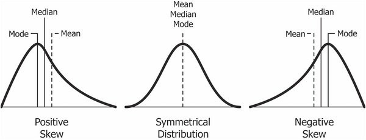

---
title: "Lab 05 - The Wage Gap Model"
output:
  html_document:
    theme: readable
    df_print: paged
    highlight: tango
    toc: yes
    toc_float: no
    css: 'lab-instructions.css'
    includes:
      after_body: 'footer.html'
--- 

```{r setup, include=FALSE}
knitr::opts_chunk$set( echo = TRUE, message = F, warning = F )
options(getClass.msg=FALSE)
```


## The Take-Away

Let's start with the end and work backwards so you know where to focus your attention. 

* If you have panel data and a large enough sample you can estimate your model in many different ways.
* We will look at the same research question using the three different estimators.
  - post-test only 
  - reflexive 
  - pre-post with comparison 
* Each estimator will produce a very different answer to the same question. 
* Your job is to choose which model provides the most defensible counterfactual. 


We get the following measures from each estimate: 

> T2 - C2  ::  wage gap = **32%** 
> 
> T2 - T1  ::  wage gap = **6%**
> 
> (T2-T1) - (C2-C1)  ::  wage gap = **3%**


Note that the estimates differ by a magnitude of 10!

Which provides the most defensible counterfactual? 


### Regression vs Research Design

The goal of this exercise is to emphasize the connections between the course work on regression mechanics you completed last term, and the research design content you have learned this term. 

Although they are distinct skills - one is a set of mathematical models and another is more like a logical reasoning exercise. But they are powerful together when they are synthesized effectively. 

One take-away from the exercise is that any time you run a regression and interpret a test of statistical significance for one of the coefficients you are implicitly leveraging one of the three estimators we have discussed this term. You will be much more effective as an analyst if you are able to explicitly identify and select the most appropriate estimator, then design your regression model to capture the estimator instead of running the most strait-forward model and allowing the choice to remain implicit. 

Another learning objective is strengthening your ability to identify the counterfactual and evaluate whether enough assumptions have been met for the counterfactual to be meaningful in a given context. 

The lab also serves as a preview of the types of labs you will have next term in CPP 525. As you get more practice with regression you will realize the real skill that differentiates you from other analysts is the ability to create models that capture the most robust and defensible counterfactuals, and ensure your interpretation captures program impact correctly. 

It is common for unskilled analysts to use models they don't fully understand and to look for the coefficient associated with the policy variable without understanding the way each model captures the counterfactual. 

A dummy variable for the treatment group might measure two completely different things in two different models depending upon what other coefficients are included in the models, as you will see below. 

Learn to take a step back, think about how you would ideally construct a counterfactual in a model, then ask whether your current model is generating the correct estimate of program impact. Examples like this will help you appreciate how powerful regression can be when used with knowledge and intent. 


<br>
<hr>
<br>


## The Policy Problem 

Female executives in the nonprofit sector read a recent report that analyzed IRS 990 tax data and concluded that there is a large gender pay gap in the sector. 

Leaders of several prominent organizations have begun building a coalition of female CEOs / Executive Directors and are researching the possibility of pursuing a class action lawsuit to seek damages that have resulted from systematic wage discrimination. 

Several large federated organizations and networks that hire hundreds of CEOs would be targeted by the lawsuit with the broader intent to establish legal precedents that help minimize pay discrimination in the future.  

You have been hired by this group to do some preliminary analysis to establish whether or not you can empirically identify the presence of **pay discrimination**. 

To argue that observed pay differences are the result of discrimination it need to be established that there is a systematic practice of offering different pay rates to two classes of people that hold the same job (typically the same title within an organization) and have the same qualifications. The groups often correspond to gender or minority status. 

These class action lawsuits have been brought against large companies that have thousands of employees because it's then possible to use rank and title as a means of establishing the criteria of "equal work". If there are systematic differences between group members all at the same rank then it can be ruled discriminatory behavior. 

The challenge in this case is establishing that a leadership class across organizations has been the victim of discrimination, i.e. female CEOs in the sector. 

Even though they all have the same title, the CEO of a hospital, the president of a university, the principal of a school, and the executive director of an arts organization all have very different jobs. 

It is your job as the expert analyst to design an evaluation that will provide strong evidence of pay bias in the sector. 

<br> 


### Decomposing the Wage Gap 

The case depends entirely on the ability to identify pay discrimination. It is important to note that the presence of a pay gap does not mean that discrimination has occurred. 

Conceptually, we can break the pay gap into three component parts. Two of these parts result from sorting processes into high-paying and low-paying CEO positions. Evidence suggests that some of this sorting occurs by choice. For example, women graduating from top MBA programs receive several offers and could go into the highest-paying, most-competitive sectors. Instead, they often exhibit a preference for jobs that trade income for flexibility. 


Part of the sorting is due to the fact that men are perceived to be better prepared for leadership positions in large organizations. This might happen at the stage of identifying talent in early stages of careers and providing mentoring and training that prepares people for leadership positions. Part of is occurs during the interview process, when genderized perceptions of leadership can disadvantage candidates. 

The third component occurs after someone is hired for a position. It is at this point that pay structure is set for people in leadership positions, often reflecting past experience, opportunity costs for the candidate, and the perceived value they will bring to the organization. This is where pay discrimination would occur - when the committees that determine the salary offers systematically pay one class (women) lower than their equally-qualified male counterparts. 

This typically occurs as a result of things like implicit bias or different negotiation tactics, not any malicious intent. Intent is not necessary for discrimination to occur, though. 

The overall pay gap will be a function of these three components. DIfferent industries or organizations will exhibit different mixes of each:


A large observed pay gap can motivate a group to explore whether discrimination has occurred, but a large gap can exist without discrimination as well. 

Or more precisely, this case is interested in pay discrimination. The component of the gap that results from discriminatory **hiring** practices would require a different study to separate voluntary sorting from gatekeeping in firms. 

<br>


### Defining the 'Treatment'

There is no real treatment in this study, no intervention that is used to create change. Gender is a fixed characteristic (as far as the study goes), and we have no control over hiring decisions. 

The counterfactual framework, however, is still meaningful. In any hiring decision when we observe the salary of a new CEO the counterfactual would describe the salary offer for a candidate that had the same qualifications but was the opposite gender. 

For convenience we can refer to one gender as the "treatment" and one as the "control". I have picked male to represent the treatment group here only because we know salaries will be higher and we typically expect the treatment group to perform better, so it makes it easier to keep track of results. 

It helps to think about the unit of analysis being the firm, which would allow the subject to be part of either the treatment or control group them. In an RCT you would be assigning CEOs to organizations, holding qualifications constant (picking from a pool of equally-qualified candidates) but randomizing on gender. 

Since we have panel data we can then leverage changes in the data to approximate a treatment scenario. By isolating transitions in the data we can compare firms that hire a new CEO with the same gender to those that hire a new CEO with the opposite gender. Although not perfect, using changes in the data to approximate treatment effects will be a huge improvement over trying to do a brute-force cross-sectional model with lots of controls. 


## Setup

### Data


Your job is to build a model that produces an unbiased estimate of pay discrimination.

You have access to millions of pay records through IRS 990 tax forms filed by the nonprofits. Unlike private corporations, these documents are in the public domain for nonprofits. 

We are utilizing the 990 e-filer public dataset that has been released in a computer-readable format and covers years 2010 to 2017. 

Your colleague has constructed a dataset that includes cases that have two executive directors during this time period. You will see that having this within-organization change will be important when constructing the counterfactual since the requirement is to determine whether we observe "equal pay for equal work". 

```{r}
d <- read.csv( "data/np-ceo-comp-data.csv" )
head( d )
```


```{r, echo=F}
NTMAJ12 <- rep( NA, nrow(d) )
NTMAJ12[ d$NTEE1 == "A" ] <- "arts"
NTMAJ12[ d$UNIV == 1 ] <- "universities"
NTMAJ12[ d$NTEE1 == "B" & d$UNIV == 0 ] <- "education"
NTMAJ12[ d$NTEE1 %in% c("C","D") ] <- "environment"
NTMAJ12[ d$HOSP == 1    ] <- "hospitals"
NTMAJ12[ d$NTEE1 %in% c("E","F","G","H") & d$HOSP == 0 ] <- "health"
NTMAJ12[ d$NTEE1 %in% c("I","J","K","L","M","N","O","P") ] <- "human services"
NTMAJ12[ d$NTEE1 == "Q" ] <- "international"
NTMAJ12[ d$NTEE1 %in% c("R","S","T","U","V","W") ] <- "public benefit"
NTMAJ12[ d$NTEE1 == "X" ] <- "religion"
NTMAJ12[ d$NTEE1 == "Y" ] <- "prof associations"
NTMAJ12[ d$NTEE1 == "Z" ] <- NA

d$NTMAJ12 <- NTMAJ12
```


This dataset is a subset of all years of compensation to focus on two periods of time for each organization. The year before a new CEO / ED starts (the **PRE** period), and the year after the new CEO takes over (the **POST** period). 

It is important to omit the transition year because there is often an overlap and the transition rarely occurs at the start of the fiscal calendar, leading to partial salaries reported that year. 

The variable TOTCOMP captures the full annual compensation package for each CEO (salary plus benefits) and has been inflation-adjusted so everything is in 2018 dollars. 

The variable **gender** is a binary representation of the sex of the CEO as either "male" or "female" (all limitations of the gender binary acknowledged). 


### Packages

```{r}
library( dplyr )
library( pander )
library( memisc )
library( stargazer )

# custom graph for diff in diff models 
source( "diff_n_diff_graph4.R" )

# set stargazer to text during development
s.type <- "text"
```

```{r, echo=F}
# change stargazer to HTML when knitting
s.type <- "html"
```


Helper functions: 


```{r}
# currency formatting function
dollarize <- function(x)
{ paste0("$", format( round( x, 0 ), big.mark="," ) ) }
```


### Aside on Specification

Skew is pretty ubiquitous in economic data like income, profit margins in companies, venture capital raised by start-ups, and GDP of countries. These data reflect a winner-take-most process much more than an equitable distribution of resources. You will observe a large proportion of cases 

We can see evidence for this in the summary statistics: 

```{r, echo=T}
summary.table <- summary( d$TOTCOMP )   
summary.table[] <- summary.table %>% dollarize() 
summary.table %>% pander()
```

And also in the visualization of the distributions: 


```{r, fig.width=10, fig.height=4}
par( mfrow=c(1,2) )

hist( d$TOTCOMP, breaks=100, 
      col="darkgray", border="white", 
      yaxt="n", ylab="" )
hist( log(d$TOTCOMP), breaks=100, 
      col="darkgray", border="white", 
      yaxt="n", ylab="" )
```

The logged models will be a lot more reliable in this case because the log transformation reduces skew and kurtosis in the data, which in turn reduces the leverage of outliers on coefficients. 


The log transformation will bring the outliers closer to the mean and thus mitigate their impact when fitting models. The outliers can also make standard errors larger or smaller than they should be, so inferences will also be more reliable once skew has been removed from the data. 


```{r, fig.width=10}
par( mfrow=c(1,2) )
plot( as.factor(d$gender), d$TOTCOMP, xlab="", ylab="Income"  )
plot( as.factor(d$gender), log(d$TOTCOMP), xlab="", ylab="Logged Income"  )
```

<br>



*Image source: https://www.excelr.com/skewness-and-kurtosis-in-data-science* 

<br>
<br>

### Interpretting Log-Linear Models 

Recall from last semester that the coefficients of log-linear models are interpreted as a percent change in Y as a result of a one-unit change in X. 

In this case X is a binary variable for male, so a one-unit change is the difference between the reference category (female) and the "treatment group" male:

```{r}
# salary ceo female: $90,000
# salary ceo male: $100,000

# PERCENT CHANGE
( 100 - 90 ) / 100

# LOG APPROXIMATION 
log( 100 ) - log( 90 )
```

For reference only, here is the math: 


```{r}
# salary ceo female: $90,000
# salary ceo male: $100,000

# LINEAR MODEL: 
# Y = b0 + b1(male)

# salary_female (omitted category)
b0 <- 90000
b1 <- 10000

# female salary (base group): b0
b0

# male salary: b0 + b1
b0 + b1


# b0 = salary_female
# salary_male = b0 + b1
# salary_male = salary_female + b1
# b1 = salary_male - salary_female

# LOG-LINEAR MODEL: 
# log(Y) = b0 + b1(male)
# b1 = log(salary2) - log(salary1)

b0 <- log(90000)
b1 <- log(100000) - log(90000)

# coefficients in log-linear model:
b0
b1

# note b1 approximates % difference 
# of salary_male to salary_female
(100000 - 90000 ) / 100000

# compare to:
b1

# recovering base salaries
exp( b0 )
exp( b0 + b1 )
```


## The Three Estimators

We are interested in how the pay gap changes with each estimator, and which is the best conceptual and empirical fit for this study. 

We will start with the easiest model and end with the best. 


### Post-Test Only Model 

The first model is a cross-sectional examination of salaries of male and female CEOs at a single point in time. The time-period is relative the hiring event (a year before and a year after), not calendar years like typical studies. 

**Estimator: T2 - C2**

We would tabulate this by examining all new hires (the post-treatment segment) compared by salary. 


```{r,results="asis"}
# compare all male CEO salaries to female CEO 

m.dat <- dplyr::filter( d, post == 1 )

m1  <- lm( TOTCOMP ~ male, data=m.dat )
m2  <- lm( log(TOTCOMP) ~ male, data=m.dat )


stargazer( m1, m2, type=s.type, digits=3,
           intercept.bottom = FALSE,
           omit.stat = c("ser","f","rsq","adj.rsq") )
```


**Strengths:** This estimator provides the unconditioned mean-difference of salaries of male and female CEOs. As such, it provides a measure of the overall pay gap without trying to desegregate by any of the contributing components. The total gap is a useful benchmark aggregate.

**Weaknesses:** The estimate does not, however, break the pay gap down into useful components. It is a good measure of the overall difference in pay, but a very poor measure of wage discrimination defined as equal pay for equal work. Specifically if we look at the types of nonprofits run by men and women we see that they are very different. 


**By Size:**

```{r}
d %>%
  group_by( gender ) %>%
  summarize( revenue = dollarize( mean(TOTALREVCURRENT) ), 
             net.assets = dollarize( mean(NETASSETSENDYEAR)) ) %>% 
  pander()
```


**By Subsector:**

```{r}

t1 <- 
d %>% 
  group_by( NTMAJ12 ) %>% 
  filter( ! is.na(NTMAJ12) ) %>% 
  summarize( prop.female = mean( gender == "F" ),
             ave.sal = mean( TOTCOMP )  ) %>%
  arrange( prop.female )

t2 <- t1
t2$ave.sal <- dollarize( t2$ave.sal )
t2 %>%  pander()
```


```{r, fig.width=10, fig.height=8, echo=F}


pos <- (c(1,2,1,3,3,4,3,3,3,1,3))[ - order(t1$prop.female)]

sector <-  toupper(t1$NTMAJ12)

plot( 1-t1$prop.female, log10(t1$ave.sal), 
      pch=NA,  bty="n", yaxt="n",
      xlim=c(0.45,0.8), ylim=c(4.8,6.2),
      xlab="Proportion CEOs MALE", ylab="" )

text( 1-t1$prop.female, log10(t1$ave.sal), sector, 
      offset=1, col="gray30",  cex=0.7 )  # pos=pos,

text( 1-t1$prop.female, log10(t1$ave.sal)-0.04, t2$ave.sal, 
      offset=1, col="black",  cex=0.8 )  # pos=pos,

abline( v=0.5, lty=2, col=gray(0.2,0.1), lwd=2 )
abline( h=log10(median(d$TOTCOMP)), lty=2, col=gray(0.2,0.1), lwd=2 )
text( 0.7, log10(median(d$TOTCOMP))-0.01, 
      paste0( "Median Salary ", dollarize( median(d$TOTCOMP) ) ), 
      col="gray80", cex=1.2, pos=3 )
```


Recall that the main assumption required by the post-test only estimator is that groups are equivalent prior to the treatment. 


Although about half of new CEOs are men and half women, there is still a lot of inertia in hiring a new CEO with the same gender as the outgoing CEO. 

Men replace men and women replace women in almost two-thirds of the cases (63% of the time). 

So the "treated group" (new CEO is a male) and the "control group" (new CEO is female) would have looked very similar to the graphs above before the transition period as well. 

```{r}
table( d$TYPE ) %>% prop.table() %>% round(2) %>% pander()
```

Interestingly, all of the fields except four are moving toward hiring approximately 50% male and 50% female CEOs in the observed period except for the three highest-paid subsectors (university presidents, hospital CEOs, and professional associations) and religion. 

The highest-paying sectors continue to gate-keep leadership positions while the rest of the sector is evolving toward an even gender split in leadership. 

```{r}
# dashes cause problems as column names
d$TYPE <- gsub( "-", "_", d$TYPE )

# re-order to group female transitions
d$TYPE <- factor( d$TYPE, levels=c("F_F","M_F","F_M","M_M") )
                  
tab <- 
  table( d$NTMAJ12, d$TYPE ) %>% 
  prop.table( margin=1 ) %>% 
  round(2) %>%
  as.data.frame()

names(tab) <- c("Subsector","TransitionType","N")

df <- 
tab %>% 
  tidyr::spread( TransitionType, N ) %>%
  mutate( All.f = F_F + M_F,
          All.m = F_M + M_M ) %>% 
  arrange( desc( All.m ) ) 

df %>% pander()
```


```{r}
par( mar=c(0,4,0,0) )

plot( df$All.m, pch=19, cex=2, type="b", 
      ylim=c(0.4,1), bty="n",
      xaxt="n", xlab="", 
      ylab="Prob of New Hire Being Male")

abline( h=0.5, col="gray" )

text( 1:length(df$All.m), df$All.m, df$Subsector, 
      srt=90, pos=3, offset=4 )
```


### Reflexive Model 

The post-test estimator offers a clear apples to oranges comparison. Because of the high correlation of the gender of leadership to organizational characteristics then comparing male CEO salaries to female CEO salaries is essentially comparing salaries of CEOs running multi-billion dollar hospitals to the salaries of CEOs running small education nonprofits (exaggerating here to emphasize the point). 

As a result, we cannot say that pay differences are wage discrimination because the work is very different in these organizations. 

Our case will be a lot stronger if we focus on transition **WITHIN** organizations, because this allows us to argue that the work is not only similar, it is practically identical. The new CEO is taking over the exact same organization as the outgoing CEO, so pay differences will not be due to organizational traits.

**Estimator:  T2 - T1**


The distinctive characteristic of the reflexive design is everyone is in the treatment group and everyone is in the control group. So this analysis only includes cases where a gender switch occurs. We will omit the cases where women replace women (F --> F) and men replace men (M --> M). 

Approximately half of the considered cases will represent the transition from M --> F CEOs and half the transition from F --> M CEOs. 

We need to be clear in how we define our treatment. To be consistent we should pick a gender that represents the treatment. Since we expect males to be paid more it is easier to use them as the treatment group because the effect will be positive, then, which is easier to interpret. 

We use the male dummy variable as the treatment in this case since each org will have exactly one male CEO and one female CEO in this two-period panel. The male dummy would capture cases where high-paid male CEOs are replaced by lower-paid female CEOs, or cases where a low-paid female is replaced by a higher-paid male. 

Importantly, we are no longer including orgs that never hire males and those that never higher females, the most gendered industries where pay gaps will be highest. 

```{r, results="asis"}
m.dat <- filter( d, GEN.CHANGE == 1 )

m1 <- lm( TOTCOMP ~ male, data=m.dat )
m2 <- lm( log(TOTCOMP) ~ male, data=m.dat )

stargazer( m1, m2, type=s.type, digits=3,
           intercept.bottom = FALSE,
           omit.stat = c("ser","f","rsq","adj.rsq") )
```


In this replacement model the estimate for the pay gap falls from 32% to 5.5%, a huge drop. It is still statistically significant at the 0.05 level. 

**Strengths:** Since we are now looking at within-org difference we can say confidently that the work (the leadership role) is the same, and the estimate shows us that the gap is smaller but still present and meaningful. 

**Weakness:** The reflexive design assumes no gains independent of the treatment over the study period. 


What would that mean in this case, and might it be a problem? When could the presence of a secular trend cause us problems in our case? 

Picture yourself on the stand as the expert witness confidently presenting your result of a 5.5% wage gap that is estimated from the reflexive model. In cross-examination, then, the defense confronts you with the information that they examined the M-M and F-F cases where no gender transition occurred. Coincidentally, we also observe a pay drop of 5.5% in these cases when the new CEO is hired. Perhaps the outgoing CEOs typically receive some bonus pay, or the incoming CEOs start out with a lower salary until the prove themselves. Whatever the explanation, the pattern is not specific to the "treated" cases where gender changes. 

Your case is basically dead in the water! You can argue that indeed there is a drop in salary during the change, but you failed to eliminate a drop in every new CEOs pay (the secular trend) as a possible explanation. If every new CEO experiences the drop you can no longer argue it is the result of discrimination. 

So what is the fix? What if we incorporate the secular trend into the model? 


### The Difference-in-Difference Estimator 

Our final estimator is helpful because it allows us to capture the typical salary change that happens during a CEO transition when gender does not change, and compare it to the cases where gender does change.

We can then take the total observed change for the "treatment" groups, and subtract out the average change of the control group that has nothing to do with gender bias since gender doesn't change. 

**Diff-in-Diff Estimator: (T2-T1) - (C2-C1)**

To make the model as clean as possible we will split the data into two groups, a baseline male CEO case and a baseline female CEO case.


```{r, results="asis"}
# switch direction so treatment is always NEW MALE CEO
df.m <- filter( d, BASELINE.MALE == 1  )
df.m$treat <- 1 - df.m$GEN.CHANGE
df.m$treat.post <- df.m$treat * df.m$post

df.f <- filter( d, BASELINE.FEMALE == 1  )
df.f$treat <- df.f$GEN.CHANGE
df.f$treat.post <- df.f$treat * df.f$post 


b.male <- lm( TOTCOMP ~ treat + post + treat.post, data=df.m )
b.male.log <- lm( log(TOTCOMP) ~ treat + post + treat.post, data=df.m )

b.female <- lm( TOTCOMP ~ treat + post + treat.post, data=df.f )
b.fem.log <- lm( log(TOTCOMP) ~ treat + post + treat.post, data=df.f )

stargazer( b.male.log, b.fem.log, 
           type=s.type, digits=3,
           intercept.bottom = FALSE,
           omit.stat = c("ser","f","rsq","adj.rsq") )
```


These tables are easier to interpret if we convert coefficients to group means: 


```{r, fig.width=10, fig.height=10}
# m = model
# d = data frame
# DV = dependent variable


par( mfrow=c(2,1) )

diff_n_diff_graph4( m.male = b.male.log, d.male=df.m, baseline.group.1="M",
                    m.female=b.fem.log, d.female=df.f, baseline.group.2="F", 
                    DV="TOTCOMP", m.title="TOTCOMP",
                    sal.pos.1=c(3,3,1,1), 
                    sal.pos.2=c(3,3,1,1), 
                    par.mar=c(2,0,1,0),
                    offset.C1=0, offset.T1=0, 
                    tip1=1.01, tip2=1.01,
                    min.y=90000, max.y=220000 )
```


We now have the following situation: after accounting for "secular trend" of natural salary changes that occur during transitions our wage gap has fallen to 4.2% and 2.6% respectively for the baseline male and baseline female cases. 

The estimates are also no longer statistically significant.

The graph also helps synthesize results from the two other estimators. The post-test only case presented a large gap, but it was across organizations. Here we can see that the M-M and F-F cases look different than the organizations that have one male and one female CEO during the study period. 

The middle groups (M-F and F-M) capture the results from the reflexive model very well. Note that the gap moving in either direction is about 5.5%:

```{r}
(155-147) / 147  # M-F case
(152-144) / 144  # F-M case
```

And also note that new CEOs replacing outgoing female CEOs get a slight bump, and those replacing outgoing male CEOs get a slight dip. Accounting for these "secular trends" or changes independent of the treatment ultimately makes our wage gap estimate smaller, and standard errors increased just enough to lose statistical significance. 


<br>
<hr>
<br>


For reference, the group means are calculated from models as follows: 

```{r, eval=F, echo=F}
# baseline male case
coefficients <- b.male.log$coefficients %>% as.numeric()

b0 <- coefficients[1]
b1 <- coefficients[2]
b2 <- coefficients[3]
b3 <- coefficients[4]

# baseline control (hires female)
exp( b0 ) %>% dollarize()

# baseline treatment (hires male)
exp( b0 + b1 ) %>% dollarize()

# new female 
exp( b0 + b2 ) %>% dollarize()

# new male
exp( b0 + b1 + b2 + b3 ) %>% dollarize()
```


### Control Variables 


Note that it is possible to add control variables to any of these models.

They are especially helpful if you can find A-type control variables that are uncorrelated with gender, as they will make standard errors small and might help recover statistical significance. 


Variables that ARE correlated with gender like organizational size and subsector will also be useful for removing bias. Note that when several are included here the wage gap falls from 32% to 25%. 

Also note, though, that changing the estimator will have a much bigger impact on your effect size than adding a lot of control variables to a cross-sectional model, which is why they are rarely used by astute evaluators when trying to capture causal effects in observational studies. 

```{r}

d$log.emp <- log( d$TOTEMPLOYEE + 1 )
d$tot.rev <- d$TOTALREVCURRENT
d$tot.rev[ d$tot.rev < 1 ] <- 1
d$log.revenue <- log( d$tot.rev )
d$subsector <- factor( d$NTEE1 )

m.dat <- dplyr::filter( d, post == 1 )
  


 
# compare all male CEO salaries to female CEO 

m1  <- lm( log(TOTCOMP) ~ male + log.emp + log.revenue + subsector - 1, data=m.dat )
m2  <- lm( log(TOTCOMP) ~ male + log.emp + log.revenue + subsector - 1, data=m.dat )

memisc::mtable( m1, m2, summary.stats=c("N") )

```


## Conclusion 

Although the raw pay gap is quite large (32% when simply comparing male to female CEOs in the nonprofit sector), the component that comprises pay discrimination turns out to be pretty small, approximately 2% to 4%. 

Since our confidence interval range on these estimates also contains zero we cannot say with confidence that the true gap is even positive (it might be zero or a slight pay gap for men according to the final models).  

Thus we would advise our client that **wage discrimination** is NOT the primary gender pay issue in the sector. Rather, it is a small number of high-paying subsectors that have predominantly male CEOs, thus preventing women from holding some of the most lucrative leadership positions in the sector. 

The preference for male CEOs may arise from natural sorting processes (women are not applying for CEOs positions in those fields by choice), or it may arise from discrimination that occurs during the hiring practices (women apply and are rarely hired). More work would be needed to tease apart those two cases. 

Your expert opinion would be the **hiring discrimination** angle would be worth exploring because the **wage discrimination** case stands on shaky ground. The closer we get to a true apples to apples comparison the smaller the wage gap becomes. 


